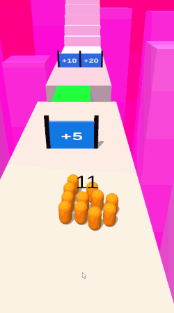

# Count-Master-Clone-Game
This is the work I did in **4 days** to create a clone of **Count Master** game. I tried to create some basic mechanics used in the game. Made with **[Unity](https://unity.com/)**.
## Deficiencies In The Project
- [ ] Enemy community
- [ ] Optimization
- [ ] Team community (with sine and cosine pattern)
- [X] Object pooling
- [ ] New level without new scene
- [ ] DOTween to the bridge
- [X] Low poly collider

## Mechanics

* Movement
  * Swipe movement
  * Following the team leader  
* Team
  * Increase the number of members of the team
  * Reducing the number of members of the team
  * Build a tower
  * Sit on the stairs
## UI
  * You win
    * Go to next level
  * You lost
    * Play again

## Gameplay
Collect as many teammates as possible and try not to fall down. The more teammates you have, the bigger tower you will get.

## Original Game
* [Google Play](https://play.google.com/store/apps/details?id=freeplay.crowdrun.com)
* [App Store](https://apps.apple.com/us/app/count-masters-crowd-runner-3d/id1568245971)
